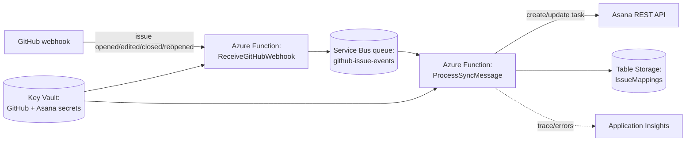

# github-asana-sync

**Status: v1 scaffolded and passing locally — not deployed to Azure yet.**
GitHub → Asana one-way sync (issues only): webhook receiver, queue processor,
Table Storage id-mapping, Asana client, and the Bicep template all exist and
build. `dotnet test` passes (11/11). Nothing has been deployed — the Bicep
template is hand-reviewed only, not machine-validated, see "Before deploying"
below.

Serverless, event-driven sync between GitHub Issues and Asana tasks, built to
show real Azure PaaS services instead of a self-hosted webhook service.

## Why this exists

The existing portfolio project (`Integration Hub — Freshdesk ↔ Asana`) proves
webhook-based integration skills, but it's a self-hosted ASP.NET Core service
with SQLite — no cloud infrastructure involved. This project is meant to prove
the other half: Azure Functions, a message queue, managed secrets and
infrastructure as code, which is what most "Integrationsutvecklare" /
"Azure-utvecklare" job ads in Stockholm actually ask for by name.

## How it will work

v1 is one-way (GitHub → Asana only) — no `receive-asana` Function yet. The
Asana → GitHub direction is future work (see "Still open" below).

1. An HTTP-triggered Function receives GitHub's webhook and does the minimum
   work to validate + drop a message on a **Service Bus** queue. This
   separates "accept the webhook fast" from "do the actual API call" — the
   same reason real integrations use a queue instead of calling straight
   through.
2. A queue-triggered Function does the sync: looks up the id mapping in
   **Table Storage**, calls the other system's REST API, and updates the
   mapping. Failed messages retry automatically and land in the dead-letter
   queue after N attempts instead of silently disappearing.
3. **Key Vault** holds the GitHub and Asana API tokens — Functions read them
   via managed identity, no secrets in config.
4. **Application Insights** traces each message through receive → queue →
   process, so a failed sync is debuggable instead of a mystery.
5. **Bicep** defines the whole resource group (Function App, Service Bus
   namespace, Storage account, Key Vault, Application Insights) so the
   environment stands up with one command and tears down the same way.

## What's built

- `src/GithubAsanaSync.Functions` — .NET isolated worker Functions app.
  - `ReceiveGitHubWebhook` — validates the `X-Hub-Signature-256` HMAC,
    parses `opened`/`edited`/`closed`/`reopened` issue events, queues a
    `SyncMessage`. Always answers GitHub 200 by design (see comment in the
    file) — a bad signature and an ignored action look identical from the
    outside.
  - `ProcessSyncMessage` — Service Bus queue trigger. Creates the Asana task
    on first sight of an issue (self-healing: an issue closed before ever
    being seen still gets created, then marked complete), otherwise updates
    completion state or adds a comment on edit.
  - `TableIdMappingStore` — one Table Storage row per synced issue
    (PartitionKey = repo, RowKey = issue number).
  - `AsanaClient` — thin wrapper over Asana's REST API v1.0.
- `tests/GithubAsanaSync.Tests` — xUnit + Moq. Signature validation
  (valid/tampered/wrong-secret/malformed-header) and the sync branching
  logic (new issue, existing issue, self-healing, edit) are covered against
  mocked `IAsanaClient`/`IIdMappingStore` — no live Azure or Asana calls in
  CI. `dotnet test` from the repo root runs everything.
- `infra/main.bicep` — Consumption-plan Function App, Service Bus (Basic,
  one queue), Storage account (Functions storage + the mapping table),
  Key Vault (both secrets, resolved into the Function App via its
  system-assigned identity + `Key Vault Secrets User` role — never as plain
  app settings), Application Insights + Log Analytics.
- `.github/workflows/ci.yml` — restore/build/test on push and PR, matching
  the other .NET portfolio project's CI shape.

## Before deploying

- **The Bicep template has not been run through `bicep build` or
  `az deployment ... --what-if`** — no Bicep/Azure CLI installed in the
  environment that scaffolded this (see the note below on why). Hand-reviewed
  for syntax, but validate for real before the first deploy.
- The identity that runs the deployment needs `Key Vault Secrets Officer` (or
  equivalent) on the target resource group *before* deploying, since the
  vault uses RBAC authorization and the template writes two secrets into it.
- Required deployment parameters: `githubWebhookSecret`, `asanaAccessToken`,
  `asanaProjectGid` (see the `az deployment group create` command at the top
  of `main.bicep`).
- Functions runtime is pinned to `.NET 8` in the Bicep template
  (`linuxFxVersion: 'DOTNET-ISOLATED|8.0'`) — that's deliberate, not an
  oversight: the Azure Functions Worker SDK (v2.0.0, current when this was
  built) rejects `net10.0` outright ("Invalid combination of TargetFramework
  and AzureFunctionsVersion"), so the Functions project targets `net8.0`
  while the test project stays on `net10.0` to match the rest of the
  portfolio and this machine's installed runtimes. Revisit if a newer
  Functions Worker SDK adds `net10.0` support.

## Still open

- [ ] Asana → GitHub direction (currently one-way, GitHub → Asana only).
- [ ] Decide whether to fold in pull requests, not just issues.
- [ ] Actually deploy `main.bicep` and register the GitHub + Asana webhooks
      against the live endpoint.

## Cost note

Service Bus has no permanent free tier (unlike the Functions Consumption
plan). Use the **Basic** tier and delete the resource group between demos —
at that usage level the real cost is close to zero, but it is not free
indefinitely like the rest of this portfolio.
